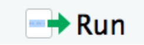

```{r include=FALSE}
knitr::opts_knit$set(eval=FALSE, tidy=TRUE, include=TRUE)
```

This session will be divided into three parts:

* General observations on Markdown
* RMarkdown / RStudio
* Shiny

Jupyter will be shown during another session (IFB cluster).

# General information

**Version:**

* 1.0 (29/08/2020) Cours IFB 2020
* 2.0 (29/06/2021) Cours IFB 2021

**Contacts:**

* Thomas Denecker <Thomas.DENECKER@france-bioinformatique.fr>
* Celine Hernandez <celine.hernandez@i2bc.paris-saclay.fr>
* Claire Toffano-Nioche <claire.toffano-nioche@universite-paris-saclay.fr>

**Resources**

* link to fastqc zip file on Zenodo

* RMarkdown
    * In RStudio: https://rmarkdown.rstudio.com/lesson-8.html
    * Cheat sheet: https://raw.githubusercontent.com/rstudio/cheatsheets/master/rmarkdown-2.0.pdf
    * And more generally : http://rmarkdown.rstudio.com 
* Jupyter
    * General documentation : https://jupyter-notebook.readthedocs.io 

* fastqcr
    * http://www.sthda.com/english/wiki/fastqcr-an-r-package-facilitating-quality-controls-of-sequencing-data-for-large-numbers-of-samples

# Part 1 : Introduction to Markdown

## What is Markdown?

Markdown is used on the Internet to specify formatting in a lightweight  and user-readable manner for : 
* Titles
* Emphasis
* Lists
* Image
* Link
* Citation
* Tasks
* Table
* And more…


## Where is Markdown ?

Everywhere ! As an introduction to the language, we will have a look at two renown websites : Wikipedia and Github, plus how it is used in RStudio (RMarkdown).

* Wikipedia : https://en.wikipedia.org/wiki/Help:Cheatsheet  
* GitHub : https://guides.github.com/features/mastering-markdown/#syntax 
* RMarkdown : https://rstudio.com/wp-content/uploads/2016/03/rmarkdown-cheatsheet-2.0.pdf

**Questions :**

* How do you format a text in italic for each site ?
* How do you write an unordered list ?

The Markdown specification had ambiguities. By consequence, its implementation can differ from one tool to another... There are many MarkdownS. Always check the specifications with which you are working.


# RMarkdown (R Notebook)

## Quick introduction to RStudio

“RStudio is an integrated development environment (IDE) for R, a programming language for statistical computing and graphics. It is available in two formats: RStudio Desktop is a regular desktop application while RStudio Server runs on a remote server and allows accessing RStudio using a web browser.” Wikipedia (30/08/2020)


## Using RStudio with Docker

> Goal : set up our workspace by building an image with the packages needed for this practical session


**Exercise: read and understand the Dockerfile**

A Docker image containing Rstudio in its server version is available from DockerHub. It has been built by the Rocker Project community. See https://www.rocker-project.org/.

At the end of the Docker practical session, we saw how to use a text file as a "recipe" to build a Docker image containing RStudio (server version). We will use a similar approach here.

This is the Dockerfile that you will use.

```
######################################################
# 
# Dockerfile to use RStudio in Docker 
# Based on bioconductor/bioconductor_docker:RELEASE_3_13
# 
###################################################### 

# Set the base image
FROM bioconductor/bioconductor_docker:RELEASE_3_13

# Install needed R packages
# Don't forget to rebuild the image if this list changes  
RUN install2.r --error --repos http://cran.rstudio.com/ \
    fastqcr

# Just a command to check which packages are installed and whth which version
RUN R -e "installed.packages()[,c(3:4)]"
```

Brief explanation of the instructions:

* FROM : defines the base image used for the newly created one. Docker will build on top of this one. Here we used the bioconductor image, built upon Rocker.
* RUN : install2.R is a convenient script provided by Rocker to assist in installing R packages. Here we only install one package.
* RUN : executes a R command that will list all installed packages and their version.

**Exercise : build a new image with the Dockerfile**

Execute the folowing command to build an image from the provided Dockerfile. Be patient, as the Rocker image is quite heavy to pull from the registry.

```{bash, eval=FALSE}
docker build -t test/myrstudio:1.0 . | tee docker_build_$(date '+%Y-%m-%d').log
```

If an exported image is provided (the whole process took a bit more than 20 minutes on my computer...), load it with the following command:

```{bash, eval=FALSE}
docker load < ./myrstudioimage.tar
```

You can check that it has been correctly loaded using ‘docker images’.


**Exercise : start a container**

Once the image is loaded, you can start a container and connect to the RStudio interface.

```{bash, eval=FALSE}
docker run --rm -p 8787:8787 -e PASSWORD=LetMeIn -v ${PWD}:/home/rstudio -w /home/rstudio test/myrstudio:1.0
```

Do not exit nor terminate the session (only when you're finished with the practical session). Open a browser and go to the URL: localhost:8787 

To connect to RStudio, use the following credentials:

* User: rstudio
* Password LetMeIn (see previous command).


## From R to R Notebook

> Goal: Transform an R script into an RMarkdown file or R Notebook

First download the files from Zenodo, or use a few of the FastQC zip files generated during any of the practical sessions.

URL : 


**Exercise : have a brief look at the R code**

As the goal of this practical session is not to learn how to code in R, a script will be provided at the beginning of the session (and in annex). The script is based on commands from the fastqcr package.

Documentation : http://www.sthda.com/english/wiki/fastqcr-an-r-package-facilitating-quality-controls-of-sequencing-data-for-large-numbers-of-samples


Briefly, the provided R script loads the output ZIP files contained in a given folder (path to adjust if necessary) into an appropriate object. Then it computes brief global statistics. Finally, it displays a set of results for one file (name to adjust if wanted).

**Exercise : Execute the script**

In RStudio, you can execute the script by:

* Selecting the whole code (or part of it) and pressing Ctrl+Enter.
* Clicking on Run (top right hand side corner of the editor pane).




Check that the code can be correctly executed.

The output of each command will appear in the Console pane. The plots at the end of the script will be displayed in the Plots pane.

Note that the script’s code can also be found at the end of this document for an easy reference.

**Anatomy of a Notebook**

A R Notebook contains well defined elements.

1. Header 

It's an optional section containing render options written as key:value pairs (YAML). 
The header is always located at the very beginning of the file and between two lines of - - - characters.

2. Text

This is the literate part of the document. It contains description of the code, explanations of the analysis, or simply any text formatted with markdown. 

3. Chunks of executable code

This is where the code goes. Each chunk begins with the characters \`\`\` (three back ticks) and ends the same way. Optionally, the engine to be used to interprete the code can be specified between curly brackets. Example: \`\`\`{r} If no engine is specified, the text will only be preformatted and not interpreted.


**Exercise : transform the script into an R Notebook**

* Change the filename extension.

Save a copy of the script, just changing the extension ".R" into ".Rmd".

* Add a header

The header is what will define default parameters of your Notebook. For instance:

```
---
title: "My first R Notabook"
author: "Insert your name here"
date: "29/06/2021"
output: 
  html_notebook: 
    toc: yes
    number_sections: yes
    theme: cerulean
---
```

Don't forget the "---" at the beginning and the end of the header. You can find and change other parameters by clicking on the little wheel at the top of the source pane.

* Make code "chunks" out out the R code

As a quick and dirty way to do the exercise, you can just put \`\`\`{r} at the beginning of the code and \`\`\` at the very end. This will embed all the code in one unique chunk. 

This will do for a first test in this practical session. But note that that's absolutely not the idea behind a notebook. And the result will not be very pretty. Instead, if you have time, try to decompose the code into as many chunks as needed in order to visualise each output in the flow of the document, and not only at the end. You can also use the comments to turn them as text between the chunks.

* Render the file

Click on the Knit or Preview button at the top left hand side of the editor pane. When you click the button a document will be generated that includes both content as well as the output of any embedded R code chunks within the document. RMarkdown will execute the code and append the results to the document. It will use the location of the .Rmd file as the working directory.


More details here: https://rmarkdown.rstudio.com/authoring_quick_tour.html 


Additional information :

Why "Knit" ? This refers to the package knitR (https://yihui.org/knitr/). 

RMarkdown and knitR are R libraries. You don’t need RStudio to use them. RStudio only provides a convenient button to knit an Rmd file. But you can do the same with an R command. This will generate the equivalent document from your Rmd file.

```{r, eval=FALSE,}
rmarkdown::render("session_07_Rmarkdown.Rmd")
```

**Exercise : Add parameters to the chunks**

Now, try to decompose the unique chunk into smaller ones.

Each code chunk can be assigned a name and parameters. For instance, \`\`\`{r, eval=FALSE} sets the eval parameter to FALSE. This can be useful if you want to illustrate your document with code that doesn't need to be executed. The above rmarkdown code is displayed using this option.

Some of the most used are:

* eval : will the code be interpreted?
* echo : should the code be displayed in the final document?
* message, warning, error : should warning or error messages generated by code execution be shown?
* cache : activate storing of intermediate results 
* fig.width, fig.height : to adjust the displayed size of images

If you click on the little wheel to the left of a code chunk, you can get help on these parameters. Note that there is also auto-completion of the parameters if you type a coma between the curly brackets specifying the engine.
  
Questions : 

* Is it a good idea not to display all this information?
* Would your answer be the same if you had to send the results of the analysis to a collaborator who doesn’t know R?


**Exercise : Insert values directly in your text**

This is a small exercise. For your information, there is the possibility to put inline code directly in the text. Insert code between a back tick r directly followed by r and another back tick, after you loaded the zip files, outside of any code chunk.

Here is an example (remove the '\\' characters) :
```{r, eval=FALSE}
Congratulations, you just have loaded \`r length(unique(qc$sample)\` sets of FASTQC results.
```

The code between back ticks will be interpreted and replaced by a value.


**Exercise : Combine with other languages**

To the difference with other Notebook editors, you can choose to embed code chunks from multiple engines. For instance, you could add a code chunk in bash at the beginning of your file with the pwd command in order to check where you are. 


**Going further**

NB: after you finished your edition, you can go and check what is provided by the fastqcr package at https://rpkgs.datanovia.com/fastqcr/qc-reports/sample-qc-report-interpretation.html
This shows a more complex report, but the basic features are present in this tutorial. 


# From R Notebook to Shiny

> Goal : make some parts of the document dynamic

Creating a Notebook was nice. But wouldn't it be better to include responsive elements ? This is what the Shiny package allows to do.

**Exercise : add the shiny runtime**

First, create a copy of your Rmd file.

The inside the header, add 
```
runtime: shiny
```
And check that the output format is set to :
```
output: html_document
```

Save your file. You should see that the "Preview" button has turned into "Run document".

**Exercise : add a dynamical element**

In order to make part of your doculent dynamic, you have to add two things.

* inputs : elements that will collect values for parameters
* elements that will update whenever a certain variable changes

For instance, this will create a drop down list with a list of files :

```{r, eval=FALSE}
all.results <- list.files(path=folderRes, pattern="*.zip", full.names=TRUE)
selectInput("filename", 
            label = "Which file?",
            choices = all.results, 
            selected = all.results[1])
```

* selectInput defines a dropdown menu
* parameter 1 is the name of the variable to be filled
* label is the text displayed before the menu
* choices are all the options of the menu
* selected is the value selected by default

After this chunk, you need to call a render\* function that can respond to a change in value.

```{r echo = FALSE}
renderPlot({
  qc_plot(input$filename, "Per base sequence quality")
})
```

This function displays a plot using the code put between curly brackets. Note that the "filename" variable filled by the selectInput function is accessible through the input object.

As a bonus exercise, you can try to add an element to choose which plot will be displayed. Read the fastqcr documentation for that.

  
More on this type of dynamical documents: https://shiny.rstudio.com/articles/interactive-docs.html

One can also build more complex interfaces : https://shiny.rstudio.com/articles/app-formats.html


# Final note

To quit RStudio, quit your R session first (upper right corner). Then go back to the terminal where you starte the "docker run" command and simply press Ctrl+C.


# Annex 

## Dockerfile

Dockerfile used to build the image necessary for this practical session.
```
######################################################
# 
# Dockerfile to use RStudio in Docker 
# Based on Rocker/rstudio:4.0.2
# bioconductor/bioconductor_docker:RELEASE_3_13
# 
###################################################### 

# Set the base image
FROM bioconductor/bioconductor_docker:RELEASE_3_13

# Install needed R packages
# Don't forget to rebuild the image if this list changes  
RUN install2.r --error --repos http://cran.rstudio.com/ \
    fastqcr \
    shiny

# Just a command to check which packages are installed and whth which version
RUN R -e "installed.packages()[,c(3:4)]"
```

## R script

A simple script used as an example during this tutorial.

```
# Practical session 1 : R script

# Goal: Load FastQC results and display summary tables and plots

# Load the fastqcr package
# fastqcr : R package to (run and) load FastQC files
# Documentation : http://www.sthda.com/english/wiki/fastqcr-an-r-package-facilitating-quality-controls-of-sequencing-data-for-large-numbers-of-samples
library(fastqcr)

# Adapt the path between double quotes as needed
folderRes <-  "./Data"

# Step 1: Load the zip files generated by FastQC
# fastqcr will look into a folder for zip files (outputs from FastQC)
qc <- qc_aggregate(folderRes)

# Step 2 : Display global summaries of what was loaded

# Content of the object where all the information was loaded by fastqcr
qc

# General statistics for all samples
qc_stats(qc)

# Tests performed by FastQC on all samples
summary(qc)

# Step 3 : focus on one sample

# List all zip files in the specified folder
all.results <- list.files(path=folderRes, pattern="*.zip", full.names=TRUE)


# Show one of the plots
qc_plot(all.results[1], "Per base sequence quality")
```

## R Notebook example

```
---
title: "My first R Notebook"
author: "Celine Hernandez, Claire Toffano-Nioche, Thomas Denecker"
date: "29/06/2021"
output: 
  html_notebook: 
    toc: yes
    number_sections: yes
    theme: cerulean
---


> Goal: Load FastQC results and display summary tables and plots

# Step 0: Load the fastqcr package

fastqcr : R package to (run and) load FastQC files

Documentation : http://www.sthda.com/english/wiki/fastqcr-an-r-package-facilitating-quality-controls-of-sequencing-data-for-large-numbers-of-samples
\`\`\`{r}
library(fastqcr)
\`\`\`

\`\`\`{r}
# Adapt the path between double quotes as needed
folderRes <-  "./Data"
\`\`\`

# Step 1: Load the zip files generated by FastQC

fastqcr will look into a folder for zip files (outputs from FastQC).

\`\`\`{r}
qc <- qc_aggregate(folderRes)
\`\`\`

# Step 2 : Display global summaries of what was loaded

Display the content of the object where all the information was loaded by fastqcr
\`\`\`{r}
qc
\`\`\`

Then, general statistics for all samples
\`\`\`{r}
qc_stats(qc)
\`\`\`

Tests performed by FastQC on all samples
\`\`\`{r}
summary(qc)
\`\`\`

# Step 3 : focus on one sample

List all zip files in the specified folder
\`\`\`{r}
all.results <- list.files(path=folderRes, pattern="*.zip", full.names=TRUE)
\`\`\`

Display one of the plots
\`\`\`{r}
qc_plot(all.results[1], "Per base sequence quality")
\`\`\`


```

## Shiny example

```
---
title: "My first R Notebook"
author: "Celine Hernandez, Claire Toffano-Nioche, Thomas Denecker"
date: "29/06/2021"
runtime : shiny
output: 
  html_notebook: 
    toc: yes
    number_sections: yes
    theme: cerulean
---


> Goal: Load FastQC results and display summary tables and plots

# Step 0: Load the fastqcr package

fastqcr : R package to (run and) load FastQC files

Documentation : http://www.sthda.com/english/wiki/fastqcr-an-r-package-facilitating-quality-controls-of-sequencing-data-for-large-numbers-of-samples
\`\`\`{r}
library(fastqcr)
\`\`\`

\`\`\`{r}
# Adapt the path between double quotes as needed
folderRes <-  "./Data"
\`\`\`

# Step 1: Load the zip files generated by FastQC

fastqcr will look into a folder for zip files (outputs from FastQC).

\`\`\`{r}
qc <- qc_aggregate(folderRes)
\`\`\`

# Step 2 : Display global summaries of what was loaded

Display the content of the object where all the information was loaded by fastqcr
\`\`\`{r}
qc
\`\`\`

Then, general statistics for all samples
\`\`\`{r}
qc_stats(qc)
\`\`\`

Tests performed by FastQC on all samples
\`\`\`{r}
summary(qc)
\`\`\`

# Step 3 : focus on one sample

List all zip files in the specified folder
\`\`\`{r}
all.results <- list.files(path=folderRes, pattern="*.zip", full.names=TRUE)
selectInput("filename", 
            label = "Which file?",
            choices = all.results, selected = all.results[1])
\`\`\`

\`\`\`{r echo = FALSE}
renderPlot({
  qc_plot(input$filename, "Basic Statistics")
})
\`\`\`

Display one of the plots
\`\`\`{r echo = FALSE}
renderPlot({
  qc_plot(input$filename, "Per base sequence quality")
})
\`\`\`


```

```{r include=FALSE}
knitr::opts_knit$set(eval=TRUE, tidy=TRUE, include=TRUE)
```
